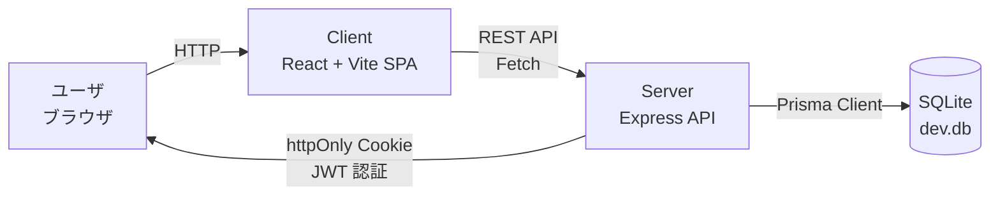
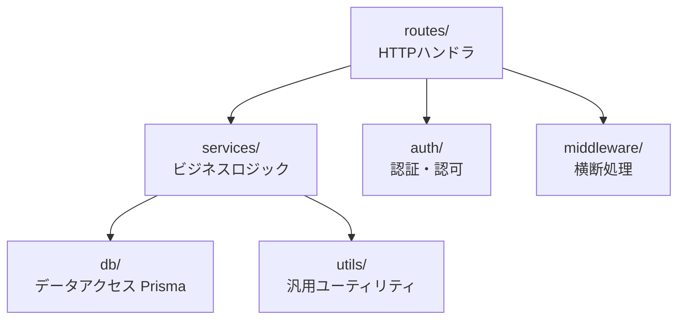

# 02. アーキテクチャ

## 1. 全体構成

ブログ/CMS アプリケーションで、React SPA（client）と Express API（server）、SQLite（DB）の3層構成です。



- **Client**（`client/`）: React 18 + Vite。API リクエストは fetch ラッパ経由。JWT は Cookie で送受信するため、トークンを JS から直接扱わない設計が理想。
- **Server**（`server/`）: Express 4。REST API を提供。Prisma 経由で SQLite にアクセス。
- **Shared**（`shared/`）: フロント・バックで共有する型定義。

## 2. バックエンドのレイヤ構成

関心の分離のため、バックエンドは以下のレイヤに分けます。各レイヤの責務は下表の通りです。



| レイヤ | ディレクトリ | 責務 |
|---|---|---|
| **HTTP ハンドラ** | `server/src/routes/` | リクエスト受付・入力取り出し・レスポンス返却。ビジネスロジックは持たない。 |
| **ビジネスロジック** | `server/src/services/` | ドメインルール・データ加工・複数テータ操作のまとめ。 |
| **データアクセス** | `server/src/db/` | Prisma クライアントのシングルトンと、生 SQL ヘルパ。 |
| **認証・認可** | `server/src/auth/` | JWT 署名/検証、パスワードハッシュ、認証ミドルウェア。 |
| **横断処理** | `server/src/middleware/` | エラーハンドラ、ロガー、セッション/Cookie。 |
| **ユーティリティ** | `server/src/utils/` | 日付フォーマット、バリデーション等の汎用関数。 |
| **設定** | `server/src/config.ts` | 環境変数読み込み・定数定義。 |

### ルーティングの担当（API エンドポイント群）

| ルータ | ファイル | 担当 |
|---|---|---|
| 認証 | `routes/auth.routes.ts` | register / login / logout / refresh |
| 投稿 | `routes/posts.routes.ts` | 投稿 CRUD / 一覧 / 詳細 / フィード / いいね / 検索 |
| コメント | `routes/comments.routes.ts` | コメント作成 / 削除 |
| 管理者 | `routes/admin.routes.ts` | ユーザ一覧（管理者専用） |
| デバッグ | `routes/debug.routes.ts` | 内部状態ダンプ（開発用） |

## 3. 認証フロー（あるべき姿）

JWT を **httpOnly Cookie** に格納し、Cookie でトークンを送受信します。JS からトークンに触れないことで XSS でのトークン窃取を防ぐのが理想の設計です。

```mermaid
sequenceDiagram
    participant U as ブラウザ
    participant S as Server
    participant DB as SQLite

    Note over U,S: 【ログイン】
    U->>S: POST /api/auth/login {email, password}
    S->>DB: ユーザ取得（email）
    S->>DB: パスワード検証（定数時間比較）
    S->>S: JWT 署名（HS256）
    S-->>U: Set-Cookie: token=...; HttpOnly; Secure; SameSite=Lax
    U->>U: Cookie を保存（JS不可達）

    Note over U,S: 【認証が必要なリクエスト】
    U->>S: GET /api/posts (Cookie: token=...)
    S->>S: JWT 検証（algorithms: HS256 のみ許可）
    S->>DB: リソース取得＋認可チェック
    S-->>U: 200 OK + JSON

    Note over U,S: 【ログアウト】
    U->>S: POST /api/auth/logout
    S-->>U: Set-Cookie: token=; Max-Age=0
```

> **注意**: 上記は **仕様としての「あるべき姿」** です。実際の実装には意図的な脆弱性（Cookie 属性の欠落、`alg: none` 許可、弱ハッシュなど）が含まれます。詳細は [05-埋め込んだ問題一覧](./05-埋め込んだ問題一覧.md) を参照してください。

## 4. フロントエンドとバックエンドの責務分担

| 責務 | 担当 |
|---|---|
| 入力バリデーション | **バックエンド** で必ず実施（フロントは UX 向けの補助のみ） |
| 認証状態の保持 | **バックエンド** が Cookie で管理。フロントは「ログイン中か？」の UI 状態のみ持つ |
| ユーザ入力の描画 | フロントで描画するが、**サニタイズは必須**（Markdown レンダラ等で XSS に注意） |
| ドメインルール・計算 | **バックエンド**（いいね数のインクリメント等もサーバ側で原子操作） |
| 共通型の共有 | `shared/types.ts` で API のリクエスト/レスポンス型を共有 |

## 5. 関連ドキュメント

- [01-技術スタック](./01-技術スタック.md)
- [03-データモデル](./03-データモデル.md)
- [04-API仕様](./04-API仕様.md)
