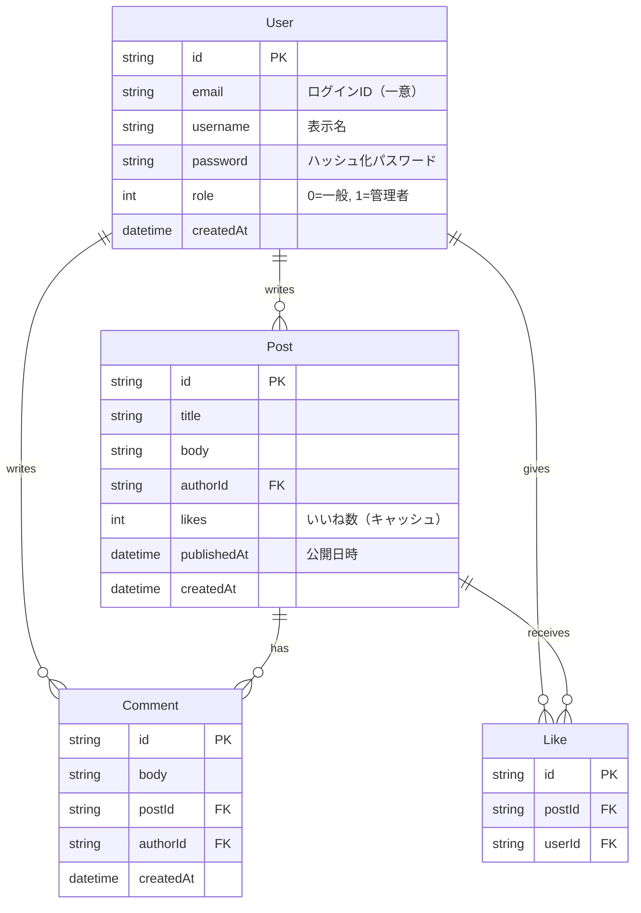

# 03. データモデル

## 1. ER 図

ブログ/CMS の主要エンティティは `User`・`Post`・`Comment`・`Like` の4つです。

## 2. Prisma スキーマのモデル説明

スキーマ定義は `server/prisma/schema.prisma` に配置します。

### 2.1 User（ユーザ）

| フィールド | 型 | 説明 |
|---|---|---|
| `id` | `String @id` | 主キー（UUID 等の文字列） |
| `email` | `String` | ログインID。本来は `@unique` で一意制約を付けるべき。 |
| `username` | `String` | 表示名。 |
| `password` | `String` | ハッシュ化したパスワード。平文で保存してはならない。 |
| `role` | `Int` | ロール。`0`=一般、`1`=管理者。 |
| `createdAt` | `DateTime` | アカウント作成日時。 |

### 2.2 Post（投稿）

| フィールド | 型 | 説明 |
|---|---|---|
| `id` | `String @id` | 主キー。 |
| `title` | `String` | タイトル。 |
| `body` | `String` | 本文。 |
| `authorId` | `String` | 投稿者（User）への外部キー。 |
| `likes` | `Int` | いいね数のキャッシュ。`Like` テーブルの集計結果を保持。 |
| `publishedAt` | `DateTime` | 公開日時。タイムゾーンの扱いに注意。 |
| `createdAt` | `DateTime` | 作成日時。 |

### 2.3 Comment（コメント）

| フィールド | 型 | 説明 |
|---|---|---|
| `id` | `String @id` | 主キー。 |
| `body` | `String` | コメント本文（Markdown / HTML を含み得るため描画時のサニタイズが必須）。 |
| `postId` | `String` | 属する投稿（Post）への外部キー。 |
| `authorId` | `String` | 投稿者（User）への外部キー。 |
| `createdAt` | `DateTime` | 作成日時。 |

### 2.4 Like（いいね）

| フィールド | 型 | 説明 |
|---|---|---|
| `id` | `String @id` | 主キー。 |
| `postId` | `String` | 対象投稿（Post）への外部キー。 |
| `userId` | `String` | いいねしたユーザ（User）への外部キー。 |

> **インデックスについて**: 高頻度で検索される外部キー（`Post.authorId`・`Comment.postId`・`Like.userId` 等）には本来 `@@index` を付けるべきですが、一部は意図的に欠落させています。詳細は [05-埋め込んだ問題一覧](./05-埋め込んだ問題一覧.md) を参照してください。

## 3. 初期シードデータ

`server/prisma/seed.ts`（またはシードスクリプト）で、動作確認用の初期データを投入します。

- **ユーザ**: 管理者1名（`role=1`）＋ 一般ユーザ2名程度
- **投稿**: 各ユーザが数件ずつ投稿
- **コメント**: 投稿に対して数件のコメント
- **いいね**: 投票パターンのサンプル

シードの目的は「レビュー対象のコードを動かして確認できること」であり、データ量は最小限で十分です。

## 4. 関連ドキュメント

- [02-アーキテクチャ](./02-アーキテクチャ.md)
- [04-API仕様](./04-API仕様.md)
